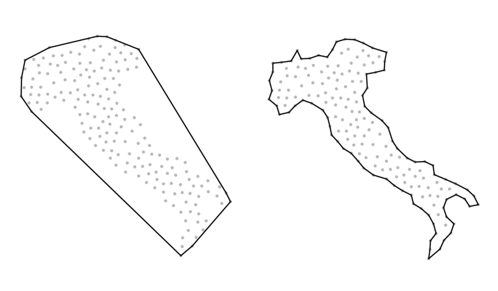

# Charshape

The characteristic shape reduction method provided by PolyShell is a novel polygon reduction built upon the
characteristic shape algorithm of Duckham et al.[^1]

[^1]: [M. Duckham, L. Kulik, M. Worboys, A. Galton, 2008. Efficient generation of simple polygons for characterizing
    the shape of a set of points in the plane.](https://doi.org/10.1016/j.patcog.2008.03.023)

## Characteristic Shape Algorithm

The algorithm presented by Duckham et al. proposes an efficient method for generating simple polygons which
"characterize" a set of points in the plane. The method works by computing the triangulation of a point cloud,
iteratively removing outward-facing edges until a shape is found which conforms to the point cloud without over-fitting.

{ width="500", loading=lazy }
/// caption
Characteristic shape of a point cloud. Adapted from Duckham et al.[^1]
///

## Adaptation to a Polygon Reduction Algorithm

The problem of polygon reduction can be viewed in a very similar way to that considered by Duckham et al. In this
instance, we still have a cloud of points in the plane, albeit with additional topological information. To satisfy
[PolyShell's axioms], it is necessary that the front never recedes into the initial shape. A minor modification is to
compute a [constrained triangulation](https://en.wikipedia.org/wiki/Constrained_Delaunay_triangulation), removing only edges which do not lie on the original polygon.

[PolyShell's axioms]: ../../user-guide/axioms.md
